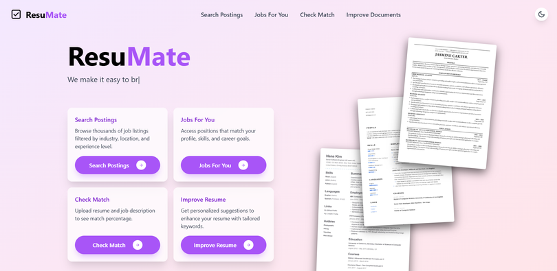
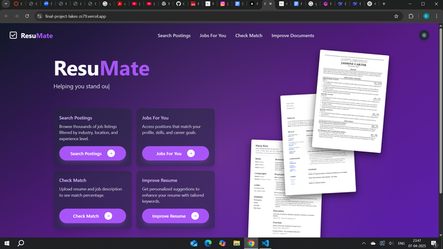

<div align="center">

# 🤖 ResuMate 🤖

### AI-powered resume analyzer, job matcher, and cover letter generator — all in one smart app.

[](https://resumate.vercel.app)


</div>

<div align="center">
  
   
</div>

<div align="center">
  
</div>

---

## 💻 Live Demo

[resumate.vercel.app](https://final-project-lakes.vercel.app/)

---

## ✨ Features

- 📄 Upload and analyze your resume using OpenAI
- 🔍 Get AI-powered job matches using multiple APIs (JSearch, Indeed, Glassdoor)
- 📝 Generate tailored, high-quality cover letters instantly
- 🖥️ Responsive UI with modern design
- ⚙️ Continuous deployment with Vercel

---

## 🛠 Tech Stack

| Component         | Technology                         |
|------------------|------------------------------------|
| Framework        | Next.js (React)                    |
| Styling          | Tailwind CSS                       |
| Deployment       | Vercel                             |
| AI Integration   | OpenAI API                         |
| Job APIs         | JSearch, Indeed, Glassdoor         |
| File Handling    | PDF Parsing with `pdf-parse`       |
| Hosting          | Vercel                             |

---

## 🖥 Local Setup

### Prerequisites

- Node.js ≥18.x
- npm
- Vercel CLI (optional)

### Installation

1. **Clone the repository**

   ```bash
   git clone https://github.com/your-username/resumate.git
   cd resumate
   ```
2. **Install dependencies**

    ```bash
   npm install
   ```
3. **Create .env.local**

    ```bash
   touch .env.local
   ```
4. **Add your API keys**

    ```bash
   OPENAI_API_KEY=your_openai_api_key
    JSEARCH_API_KEY=your_jsearch_api_key
   ```
5. **Run the app**

    ```bash
   npm run dev
   ```
6. **Visit the local site**

    ```bash
   http://localhost:3000
   ```


